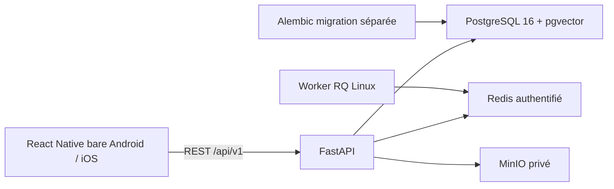

# Architecture et limites du socle

La phase 1 crée les fondations. Les images et les analyses médicales ne sont pas encore
traitées. Aucun modèle fictif n'est présenté comme une IA clinique.

## Identité

Inscription publique : rôle `USER` exclusivement. Le consentement `APPLICATION_USE`
est explicite et enregistré avec version de politique. Aucun consentement recherche
ou entraînement n'est déduit de l'inscription. Le texte actuel est destiné au
développement ; la politique finale doit être définie avant une utilisation réelle.

Argon2 hache les mots de passe. JWT HS256 vérifie signature, expiration, type,
émetteur et audience. Les rôles sont lus en base à chaque requête. Les refresh tokens
sont des secrets aléatoires stockés uniquement sous forme SHA-256, renouvelés dans
une transaction verrouillée en PostgreSQL. La réutilisation révoque leur famille.
La déconnexion révoque la famille de renouvellement ; un access token déjà émis
expire au plus tard après 15 minutes. Une révocation immédiate des access tokens
reste à ajouter si le futur cahier de sécurité l'exige.

Le mobile conserve le refresh token dans le Keychain/Keystore et l'access token
en mémoire. L'adresse API est configurable pour le développement. Aucun appel direct
au modèle ne se trouve dans l'application.

## Infrastructure de développement

Compose n'expose ni PostgreSQL ni Redis. L'API et la console MinIO sont accessibles
uniquement sur loopback. Un service ponctuel migre la base avant l'API et le worker.
Un autre crée le bucket et désactive son accès anonyme. Les secrets sont générés
localement et `.env` est ignoré. Le worker écoute `analysis` et ne reçoit encore
aucune tâche d'inférence : le contrat des scans sera ajouté en phase 2/3.

Ce Compose est destiné au développement. Avant production : TLS en frontal,
identité S3 applicative avec permissions minimales (ici les credentials MinIO sont
administrateurs locaux), chiffrement des volumes/objets et sauvegardes, rotation
des secrets, proxy explicitement approuvé, politique de conservation, restauration
testée et supervision. Aucune conformité réglementaire n'est revendiquée.

Les journaux applicatifs contiennent un identifiant de requête, la route modèle,
le statut et la latence. Ils excluent query strings, corps, emails, mots de passe,
tokens, photos et symptômes. Les logs d'accès Uvicorn sont désactivés dans Docker.

## Validation

Les tests unitaires et API utilisent SQLite isolé ; ils ne prouvent pas les
verrous PostgreSQL. La suite Compose `scripts/smoke.py` vérifie les vrais services.
La CI prévoit les deux, plus la compilation Android et iOS. Une CI écrite n'est
pas une CI exécutée : consulter `docs/status.md` pour les résultats effectifs.

## Architecture future

Après validation des builds natifs : Kotlin CameraX et Swift AVFoundation,
qualité à 5–10 Hz, capture haute résolution, stabilisation 3A, contexte/intermédiaire/
gros plan et seconde validation serveur. Les seuils seront configurés, calibrés
sur plusieurs appareils et évalués par teinte de peau, sans correction agressive.

Ensuite : `VisionBackbone` interchangeable, mock explicitement fictif,
MedSigLIP avec têtes supervisées, calibration et détection hors distribution,
moteur de décision déterministe indépendant, produits et suivi, portail dermatologue.
Un modèle chargé sans têtes et données de validation ne constitue pas une analyse fiable.
Le jeu de recherche sera distinct de la production, soumis au consentement et séparé
par patient entre entraînement/validation/test.
